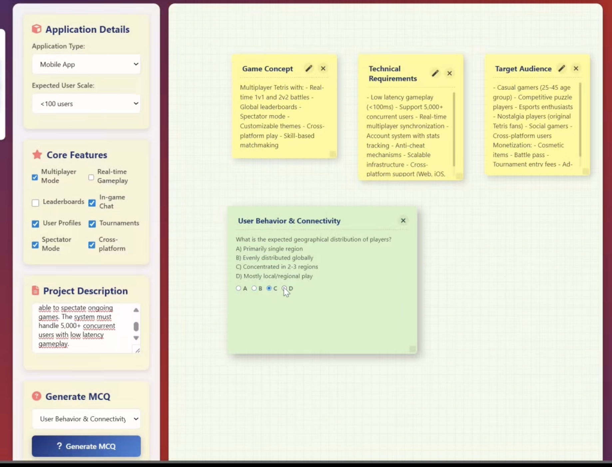

# A lightweight AI-Powered System Architecture Design Assistant


A lightweight, interactive tool that helps users design software system architectures through AI-powered suggestions, visual diagrams, and notes editing.


## Overview

This application provides a whiteboard-style interface where users can:
- Interpret project visions in detail through interactive sessions
- Identify key modules and refine requirements with AI guidance
- Automatically generate structural diagrams and documentation
- Lower communication and decision-making costs in architecture design

## Key Features

### Control Panel
- **API Choice**: Support for both OpenAI and Gemini AI backends
- **Feature Customization**: 
  - Application type selection
  - Core feature selection
  - Project description input
- **Generation Types**:
  - Text output in sticky notes
  - Architecture proposals
  - Visual diagrams

### Whiteboard Interface
- **Sticky Notes**: Add, delete, edit, and freely move notes
- **Bins System**:
  - **Trash Bin**: Delete, permanently remove, or restore notes
  - **Doc Bin (Favorites)**: Store important information 
  - Visibility control for both bins

### AI-Powered Capabilities
- Architecture suggestion generation
- Mermaid.js diagram creation from architectural descriptions
- Multiple-choice question generation to clarify project requirements
- Note content suggestions based on existing context


## Recent Updates

### MCQ Generation


### Diagram Generation and Editing


## Installation & Setup

### Backend Setup
1. Install Python dependencies:
```bash
pip install -r requirements.txt

```
2. Create an api.env file with your API key:


```bash
OPENAI_API_KEY=your_openai_api_key
# OR
GEMINI_API_KEY=your_gemini_api_key

```

3. Start the backend server:

```bash
python backend.py # For using OpenAI
# OR
python backend_Gemini.py # For Using Gemini

```

4. Open index.html in the browser


-------
