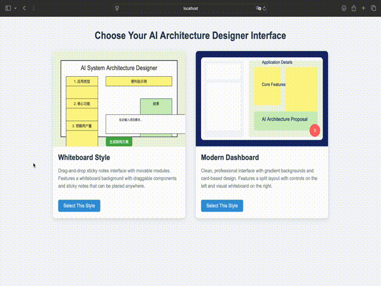
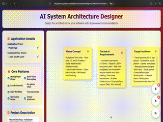

# A lightweight AI-Powered System Architecture Design Assistant

- Interpret project visions in details interactively
- Guide users with identifying key modules and refining needs
- Auto-generate structural diagrams and documentation
- Lower the threshold of high communication and decision-making costs.

## Still ongoing

## Entry point demonstration

## Whiteboard Style

...

## Modern Dashboard

Key changes in this version:
	Add all note contents in the logic of generating architecture
	Added empty notes inspired by llm (with bugs)
	Trash bin displays deleted content 
	Visibility control of doc bin and trash bin
	memo generated by ai can be stored
	Diagram can be downloaded
	Using Gemini instead of OpenAI API

 
Control Panel
- API choice
	- OpenAI
	- Gemini
- Feature customization
	- ##### Application Details
	- ##### Core Features
	- ##### Project Description
- Generation type
	- Text (in sticky notes)
	- Architecture
	- Diagram

Whiteboard
- Sticky note
	- Addition, Deletion, Editing
	- Free move
- Bins
	- Trash bin
		- Deleting permanently
		- Restoring
		- Clear All
	- Doc bin (Favorites)
		- Stored information in form of KV pairs "Type : Content"
	- Visibility control
	
- 
...
